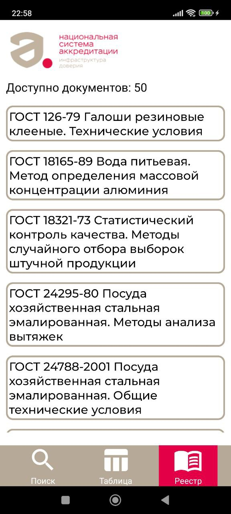

# TOLMAS PROJECT

### *Вас приветствует команда K-Team!* **Вашему вниманию** представляется программный модуль по классифицикации и формированию рекомендательных отчетов по сведениям, относящимся к испытаниям продукции, включая сведения о необходимых условиях испытаний, применяемых методах и используемом оборудовании.
Предлагаем опробовать приложение на <http://46.148.230.198/8080>!
Скринкаст доступен по ссылке <https://disk.yandex.ru/i/pmh7YyY0gjyHTw>!
# Требования к эксплуатации

**Для запуска приложения представлены следующие требования:**

1) *Python => 3.8.0*
2) *PostgreSQL => 16*
3) *Docker => 4.25.0*
4) *NodeJS => v16.14.2*
5) *Библиотеки из requirements.txt (для работы модулей анализа и fastAPI)*;
6) *Широкополосное стабильное подключение к ИТКС "Интернет"*

# Способы запуска проекта
## С помощью контейнера
  Сервис имеет высокую адаптируемость, что позволяет его запустить в виде Docker-контейнера.
#### Подключение к БД
  Редактируйте файл *DB.env* в корне проекта, напишите в нем данные для подключения к БД PostgreSQL

`PORT = 5432`

`DB_HOST = db`

`DB_LOCAL = localhost`

`LOCAL_DB = db`

`LOCAL_USER = postgres`

`LOCAL_PASSWORD = password`

`POSTGRES_DB = my_db`

`POSTGRES_USER = my_user`

`POSTGRES_PASSWORD = my_user_pass`

  Все переменные с приставкой LOCAL - для локального запуска
  Все переменные с приставкой POSTGRES - для запуска в Docker контейнере

#### Запуск Docker-контейнера
  Перейдите в корень проекта и выполните команду:
  
  `docker compose up -d`, ожидайте выполнения команды. По завершению переходите на http://ваш_хост:5000/docs в документацию Backend - части проекта

  По адресу http://ваш_хост:8080/ будет находиться клиентская часть приложения

  в случае каких-либо ошибок, пишите напрямую @qTemio
  
## Запуск приложения вручную
  В случае возникновения неполадок при сборке docker-контейнера обращайтесь к любому члену команды, однако есть возможность запустить проект вручную.

#### Виртуальное окружение

Откройте терминал в директории `fastapi` проекта, выполните команды:

```
python -m venv venv

\venv\Scripts\activate

pip install -r requirements.txt
```

#### PostgreSQL

Инициализируйте пользователя и БД.
В папке database используйте скрипт init.sql 

#### FastAPI

Для запуска в ручном режиме поменяйте значение переменной PRODUCTION = True на PRODUCTION = False (fastapi/main.py, 55 строчка)

В той же директории выполнить:

`uvicorn main:app --host=ваш_хост --port=5000 --reload`

После того как вы запустите свою БД, выполнив команду выше будут подняты инстансы fastApi и PostgreSQL. Далее необходимо запустить клиентскую часть приложения

#### Frontend
В папке `frontend` создайте два файла для подключения клиентской части к серверной:

1) .env
2) .env.production
   
В этих файлах напишите IP-адрес серверной части приложения в формате:

`VUE_APP_USER_IP_WITH_PORT = *ВАШ IP*:8000`

Откройте терминал в папке `frontend`, выполните команды:

`npm install`

`npm run serve`

После этого frontend-часть этого проекта будет доступна на *http://localhost:8080/*.
## Запуск вручную на мобильном устрройстве
Необходимо скачать файл tolmas.apk в папке mobile репозитория на ваше мобильное устройство и запустить установку.
## Краткое описание проекта
В основе решения лежит модель определения соответствия технического оборудования и руководящих документов. Зная текст руководящего документа по заранее составленной архитектуре текстового представления нужных нам данных, а также зная соответствие групп продукции к необходимому проверочному оборудованию можем получить оценку достоверности пользовательского ввода результатов испытания своей продукции, что способно помочь как заказчику (выявление злоумышленников и недобросовестных поставщиков), так и клиентам (рекомендательная система по подборке руководящего документа и соответствующих ему технических испытаний). В результате выполненной работы было выполнено 2 задачи: проверка введенного пользовательского оборудования на корректность; определение оборудования по введенному  полю "Наименование продукции".

#### Стэк технологий:

FastAPI, VueJS, PostgreSQL, Docker (docker-compose), gensim, tensorflow, nltk, scikit-learn, Java

### Технические особенности:
*Дописать* 

### Уникальность:
*Дописать*

### Скриншоты веб-приложения

### Таблица для проверки файлов, подобных *dataset.csv*

### Детальный просмотр каждой строчки таблицы
 
### Форма поиска оборудования по наименованию продукции
 

### Anrdroid-приложение
<p style="text-align:center">

</p>
